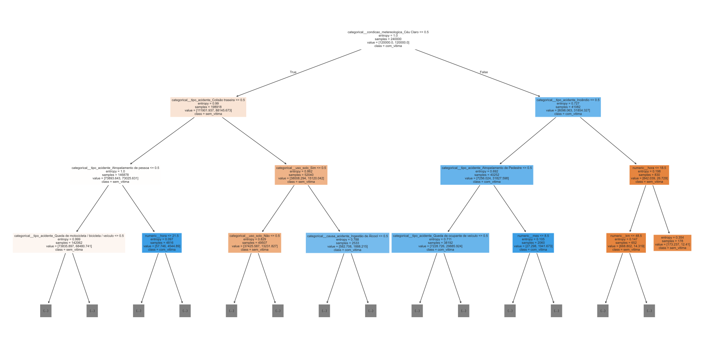
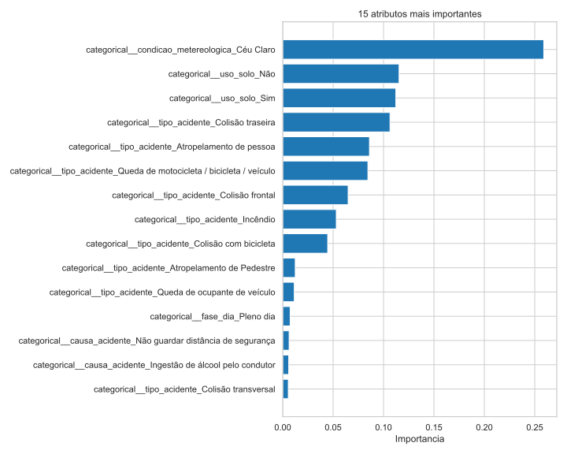
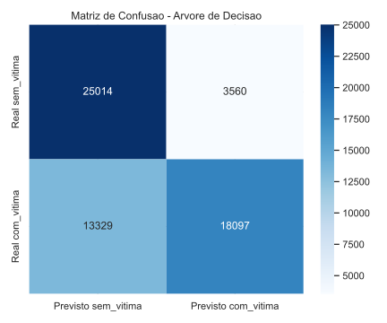

# Apoio a Decisao para Campanhas Educativas no Transito com Uso de Arvore de Decisao

## Resumo

Este projeto apresenta uma analise de dados aplicada ao contexto da seguranca viaria, com foco na identificacao de atributos associados a ocorrencia de vitimas em sinistros registrados em rodovias brasileiras. Utilizou-se a base historica DATATRAN, composta por 19 arquivos anuais referentes ao periodo de 2007 a 2025, totalizando 2.194.861 registros. O objetivo consistiu em desenvolver um modelo de classificacao baseado em Arvore de Decisao, com criterio de entropia e ganho de informacao, a fim de distinguir ocorrencias `com vitima` e `sem vitima`. O processo envolveu consolidacao da base, tratamento de inconsistencias, definicao do atributo-alvo, prevencao de vazamento de dados, treinamento do modelo e avaliacao por meio de acuracia e matriz de confusao. Os resultados indicaram acuracia de `0,7185`, com destaque para as variaveis `tipo_acidente`, `condicao_metereologica` e `uso_solo` como os principais fatores explicativos da ocorrencia de vitimas. A partir dos achados, foram propostas diretrizes para campanhas educativas voltadas especialmente a pedestres, motociclistas, ciclistas e condutores expostos a situacoes de maior risco, como atropelamentos, colisoes frontais e ocorrencias noturnas.

**Palavras-chave:** mineracao de dados; arvore de decisao; sinistros de transito; seguranca viaria; apoio a decisao.

## 1. Introducao

Os sinistros de transito representam um relevante problema social e de saude publica, sobretudo em contextos rodoviarios de grande circulacao e elevada exposicao ao risco. No ambito da gestao publica, a elaboracao de campanhas educativas costuma ser orientada por experiencia institucional, observacoes operacionais e estatisticas agregadas. Embora tais elementos sejam importantes, a crescente disponibilidade de bases historicas de grande volume permite a incorporacao de abordagens analiticas mais robustas no processo de tomada de decisao.

Nesse contexto, o presente projeto busca responder a seguinte questao: quais caracteristicas dos sinistros estao mais associadas a ocorrencia de vitimas e, portanto, devem ser priorizadas em campanhas educativas e acoes preventivas? Para responder a essa pergunta, foi empregada a tecnica de Arvore de Decisao, adequada para problemas de classificacao e especialmente util quando se deseja interpretar as regras e os atributos mais relevantes na explicacao de um fenomeno.

O objetivo geral do estudo foi desenvolver uma analise orientada por dados para identificar atributos relevantes associados ao resultado do sinistro, distinguindo ocorrencias `com vitima` e `sem vitima`, bem como propor direcionamentos praticos para campanhas educativas no transito.

## 2. Fundamentacao teorica

Arvores de Decisao constituem uma tecnica supervisionada de aprendizado de maquina amplamente empregada em tarefas de classificacao e regressao. Seu funcionamento baseia-se na divisao sucessiva dos dados em subconjuntos mais homogeneos, a partir da selecao de atributos que maximizam criterios como ganho de informacao e reducao de impureza. Quando o criterio utilizado e a entropia, o modelo seleciona, em cada etapa, o atributo que melhor reduz a incerteza sobre a classe de interesse.

Uma das principais vantagens da Arvore de Decisao em estudos aplicados a politicas publicas reside em sua interpretabilidade. Diferentemente de modelos mais complexos, a estrutura arborea permite compreender quais variaveis participam das decisoes do modelo e como determinadas combinacoes de atributos se relacionam a um desfecho especifico. Tal caracteristica e particularmente importante quando o objetivo nao se limita a prever eventos, mas tambem a apoiar decisores com informacoes compreensiveis e acionaveis.

No presente estudo, a tecnica foi adotada nao apenas pela capacidade preditiva, mas pela possibilidade de extrair conhecimento relevante para orientar campanhas educativas, priorizacao de grupos de risco e definicao de estrategias preventivas.

## 3. Materiais e metodos

### 3.1 Base de dados

Foram utilizados os arquivos anuais da base DATATRAN armazenados em `CSV/`, cobrindo o periodo de 2007 a 2025. A consolidacao resultou em `2.194.861` registros distribuidos em `19` arquivos CSV.

O conjunto consolidado apresentou a seguinte distribuicao do desfecho:

- `sem_vitima`: `1.045.254` registros
- `com_vitima`: `1.149.607` registros

Nao houve descarte de registros na etapa final de definicao do alvo, embora a base apresentasse heterogeneidade estrutural entre os anos, variacoes de encoding e valores ausentes em algumas colunas categoricas.

### 3.2 Ferramentas e bibliotecas

O desenvolvimento foi realizado em Python, com uso das seguintes bibliotecas:

- `pandas`, para leitura, consolidacao e transformacao dos dados
- `scikit-learn`, para preprocessamento, treinamento e avaliacao do modelo
- `matplotlib` e `seaborn`, para geracao de visualizacoes
- bibliotecas auxiliares da linguagem, como `pathlib`, `json`, `re` e `unicodedata`

Essas ferramentas foram selecionadas por sua ampla utilizacao em ciencia de dados e por oferecerem recursos suficientes para reproducao do fluxo analitico proposto.

### 3.3 Preparacao e tratamento dos dados

Inicialmente, foi implementado um script em Python capaz de localizar automaticamente todos os arquivos `datatran*.csv` na pasta da base. Em seguida, procedeu-se a leitura dos arquivos com separador `;`, consolidando-os em uma unica estrutura tabular.

O atributo-alvo foi definido como `com_vitima`, assumindo valor `1` para registros associados a vitimas feridas ou fatais e valor `0` para registros sem vitimas. Essa classificacao foi obtida prioritariamente a partir de `classificacao_acidente` e, quando necessario, complementada pelos campos `mortos`, `feridos`, `feridos_leves` e `feridos_graves`.

Foram criadas ainda variaveis derivadas, como `mes`, `hora` e `fim_de_semana`, visando ampliar a capacidade explicativa do modelo. As variaveis categoricas foram codificadas por `OneHotEncoder`, e as numericas passaram por imputacao simples.

### 3.4 Controle de vazamento de dados

Considerando que o objetivo era explicar a ocorrencia de vitimas a partir das caracteristicas do sinistro, foram excluidos dos atributos preditores os campos diretamente relacionados ao desfecho final, tais como `classificacao_acidente`, `mortos`, `feridos`, `feridos_leves`, `feridos_graves`, `ilesos`, `ignorados` e `pessoas`.

Essa decisao metodologica foi necessaria para evitar vazamento de dados, isto e, impedir que o modelo aprendesse com informacoes que, na pratica, representam o proprio resultado que se deseja explicar.

### 3.5 Variaveis utilizadas

As principais variaveis de entrada utilizadas no modelo foram:

- `uf`
- `br`
- `dia_semana`
- `causa_acidente`
- `tipo_acidente`
- `fase_dia`
- `sentido_via`
- `condicao_metereologica`
- `tipo_pista`
- `tracado_via`
- `uso_solo`
- `mes`
- `hora`
- `km`
- `veiculos`
- `fim_de_semana`

### 3.6 Modelagem

O algoritmo escolhido foi `DecisionTreeClassifier`, da biblioteca `scikit-learn`, configurado com os seguintes parametros:

- `criterion="entropy"`
- `max_depth=8`
- `min_samples_split=200`
- `min_samples_leaf=100`
- `class_weight="balanced"`
- `random_state=42`

Esses parametros foram definidos para atender ao requisito de utilizacao de entropia e ganho de informacao, ao mesmo tempo em que se buscou reduzir o risco de sobreajuste.

### 3.7 Treinamento e avaliacao

Devido ao elevado volume da base consolidada, foi utilizada uma amostra estratificada de `300.000` registros para a modelagem, preservando a distribuicao entre as classes. A base foi dividida em:

- `240.000` registros para treinamento
- `60.000` registros para teste

As metricas utilizadas para avaliacao foram acuracia, matriz de confusao e medidas derivadas do `classification_report`, com enfase em precisao, recall e F1-score.

## 4. Resultados e discussao

### 4.1 Desempenho do modelo

O modelo apresentou os seguintes resultados no conjunto de teste:

- acuracia: `0,7185`
- precisao para `sem_vitima`: `0,6524`
- recall para `sem_vitima`: `0,8754`
- precisao para `com_vitima`: `0,8356`
- recall para `com_vitima`: `0,5759`
- F1-score ponderado: `0,7132`

Os resultados indicam desempenho satisfatorio para uma base real, ampla e heterogenea. Observa-se que o modelo foi mais eficaz na identificacao de ocorrencias `sem_vitima`, ao passo que apresentou menor capacidade de recuperar todos os casos `com_vitima`. Ainda assim, o desempenho obtido e suficiente para finalidades de apoio gerencial, sobretudo por permitir interpretacao dos fatores associados a gravidade do sinistro.

### 4.2 Importancia das variaveis

A agregacao das importancias revelou o seguinte ranking das variaveis mais relevantes:

| Variavel | Importancia |
|---|---:|
| `tipo_acidente` | 0,4718 |
| `condicao_metereologica` | 0,2594 |
| `uso_solo` | 0,2276 |
| `causa_acidente` | 0,0218 |
| `fase_dia` | 0,0079 |
| `uf` | 0,0062 |

Os resultados demonstram que a natureza do sinistro, o contexto ambiental e a localizacao funcional do evento sao os elementos mais influentes na explicacao da ocorrencia de vitimas. Em termos praticos, isso significa que o tipo de acidente registrado, as condicoes meteorologicas observadas e a caracterizacao do local possuem maior capacidade de distinguir eventos mais graves dos menos graves.

Entre os atributos codificados de maior destaque, foram observadas categorias relacionadas a `Colisao traseira`, `Atropelamento de pessoa`, `Queda de motocicleta / bicicleta / veiculo`, `Colisao frontal`, `Incendio` e `Colisao com bicicleta`, alem de valores associados a `uso_solo` e `condicao_metereologica`.

### 4.3 Padroes associados a ocorrencia de vitimas

A analise descritiva complementar apontou que determinados tipos de acidente apresentam proporcoes extremamente elevadas de ocorrencia `com_vitima`, entre os quais:

- `Atropelamento de Pedestre`: `98,68%`
- `Atropelamento de pessoa`: `98,59%`
- `Queda de ocupante de veiculo`: `98,04%`
- `Colisao com bicicleta`: `96,36%`
- `Queda de motocicleta / bicicleta / veiculo`: `94,81%`
- `Colisao transversal`: `88,49%`
- `Colisao frontal`: `85,85%`

No que se refere as causas registradas, destacaram-se:

- `Pedestre cruzava a pista fora da faixa`: `99,16%`
- `Pedestre andava na pista`: `98,53%`
- `Entrada inopinada do pedestre`: `97,99%`
- `Falta de Atencao do Pedestre`: `97,57%`
- `Trafegar com motocicleta entre as faixas`: `97,42%`
- `Mal subito do condutor`: `93,04%`
- `Conversao proibida`: `92,96%`

Esses resultados sugerem forte peso de fatores comportamentais e de exposicao direta ao risco, com destaque para a vulnerabilidade de pedestres, motociclistas e ciclistas, bem como para a periculosidade de colisoes frontais e transversais.

Adicionalmente, a fase `Plena Noite` apresentou maior proporcao de ocorrencias com vitimas entre as categorias analisadas, reforcando a relevancia de campanhas voltadas a conducao defensiva em periodos de menor visibilidade.

### 4.4 Implicacoes para campanhas educativas

Com base nos resultados obtidos, recomenda-se que as campanhas educativas sejam estruturadas em tres eixos prioritarios.

O primeiro eixo deve ser direcionado a protecao de pedestres, com enfase em travessia segura, evitacao de deslocamento sobre a pista e reforco de atencao em areas urbanizadas proximas a rodovias. O segundo eixo deve ser orientado a motociclistas e ciclistas, destacando riscos associados a trafego entre faixas, quedas, uso inadequado de equipamentos de seguranca e interacoes perigosas com outros veiculos. O terceiro eixo deve focalizar a conducao defensiva, especialmente em cenarios de colisao frontal, colisao transversal, colisao traseira e circulacao noturna.

Do ponto de vista da gestao publica, os achados tambem indicam a necessidade de ampliar a sinalizacao e a iluminacao em trechos criticos, fortalecer a fiscalizacao de comportamentos de risco e integrar campanhas com escolas, municipios e operadores de transporte.

## 5. Visualizacoes do modelo

### 5.1 Grafico 1 - Previa da arvore de decisao

**Analise do grafico:** a visualizacao dos primeiros niveis da arvore mostra que o modelo separa os registros com base em poucos atributos de alto poder discriminatorio. Nos ramos iniciais aparecem principalmente categorias de `tipo_acidente`, como quedas e atropelamentos, e categorias de `uso_solo`, evidenciando que a classificacao entre acidentes com e sem vitimas depende fortemente da natureza da ocorrencia e do contexto espacial onde ela acontece. Isso reforca a interpretacao de que sinistros envolvendo usuarios vulneraveis e determinados cenarios de via tendem a apresentar maior gravidade.

### 5.2 Grafico 2 - Importancia dos atributos

**Analise do grafico:** o grafico de importancia evidencia a concentracao do poder explicativo em poucas variaveis. As informacoes agregadas do projeto mostram `tipo_acidente` (`0,4718`), `condicao_metereologica` (`0,2594`) e `uso_solo` (`0,2276`) como os grupos mais relevantes. No detalhamento por categoria, destacam-se `Colisao traseira`, `Atropelamento de pessoa`, `Queda de motocicleta / bicicleta / veiculo`, `Colisao frontal`, `Incendio` e `Colisao com bicicleta`. Em termos gerenciais, isso indica que campanhas preventivas devem priorizar situacoes de acidente e ambientes de risco especificos, em vez de depender apenas de recortes genericos por localidade.

### 5.3 Grafico 3 - Matriz de confusao

**Analise do grafico:** a matriz de confusao mostra `25.014` classificacoes corretas para `sem_vitima` e `18.097` classificacoes corretas para `com_vitima`. Os principais erros ocorreram em `3.560` casos em que acidentes sem vitima foram previstos como com vitima e em `13.329` casos em que acidentes com vitima foram previstos como sem vitima. Isso confirma que o modelo e mais forte para reconhecer ocorrencias sem vitima do que para recuperar todos os eventos com vitima, coerente com os valores de recall observados. Mesmo assim, o desempenho e util para apoio a decisao, especialmente quando combinado com a interpretacao dos atributos mais relevantes.

## 6. Limitacoes do estudo

Algumas limitacoes devem ser registradas. Em primeiro lugar, a base apresenta mudancas de padrao entre os anos analisados, o que pode afetar a comparabilidade integral entre registros. Em segundo lugar, foram observados problemas de encoding e padronizacao textual em algumas categorias, exigindo tratamento previo. Alem disso, o treinamento foi realizado sobre amostra estratificada, e nao sobre a totalidade dos registros, de modo a viabilizar o processamento em ambiente local. Por fim, embora a acuracia obtida seja adequada para apoio a decisao, o modelo nao deve ser interpretado como instrumento de previsao perfeita da gravidade dos sinistros.

## 7. Conclusao

O presente trabalho demonstrou a viabilidade do uso de Arvore de Decisao como ferramenta de apoio a decisao para campanhas educativas no transito. A partir da consolidacao da base DATATRAN e da aplicacao de um modelo supervisionado com criterio de entropia, foi possivel identificar os atributos mais associados a ocorrencia de vitimas em sinistros rodoviarios.

Os resultados evidenciaram que `tipo_acidente`, `condicao_metereologica` e `uso_solo` foram as variaveis mais relevantes para a classificacao do desfecho. Adicionalmente, a analise apontou especial criticidade de atropelamentos, quedas envolvendo usuarios vulneraveis, colisoes frontais e colisoes transversais, assim como maior exposicao em contextos noturnos.

Conclui-se, portanto, que a utilizacao de tecnicas de aprendizado de maquina contribui para transformar grandes volumes de dados historicos em conhecimento aplicavel a formulacao de campanhas educativas mais direcionadas, permitindo melhor focalizacao do publico-alvo e uso mais eficiente de recursos publicos.

## 8. Estrutura do projeto

- `analise_sinistros.py`: script principal de leitura, tratamento, treinamento e exportacao de artefatos
- `relatorio_analise_sinistros.md`: relatorio academico do estudo
- `CSV/`: base historica da Polícia Rodoviaria Federal
- `output/`: arquivos gerados pelo modelo

## 9. Arquivos gerados

O script `analise_sinistros.py` gera automaticamente os seguintes artefatos na pasta `output/`:

- `metricas_modelo.json`
- `resumo_base.json`
- `matriz_confusao.csv`
- `matriz_confusao.svg`
- `importancia_atributos.csv`
- `importancia_por_variavel.csv`
- `importancia_atributos.svg`
- `arvore_preview.svg`

## Os arquivos *.csv foram baixados da base de sinistros de trânsito da Polícia Rodoviaria Federal

htps://dados.gov.br/dados/conjuntos-dados/sinistros-de-transito-agrupados-por-ocorrencia 

